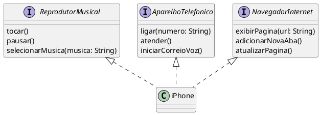

## Desafio de Modelagem e Implementação de um iPhone em UML e Java

Este desafio proposto pela Digital Innovation One (DIO) tem como objetivo consolidar os conhecimentos em análise de requisitos, programação orientada a objetos e modelagem UML, utilizando o iPhone como estudo de caso.

## Descrição do Desafio

O desafio consiste em modelar e implementar as principais funcionalidades de um iPhone, abrangendo seus três papéis principais:

1.  **Reprodutor Musical:** Tocar, pausar e selecionar músicas.
2.  **Aparelho Telefônico:** Realizar e atender chamadas, gerenciar correio de voz.
3.  **Navegador de Internet:** Exibir páginas, gerenciar abas e atualizar conteúdo.

## Modelagem UML

O diagrama de classes UML a seguir ilustra a estrutura do sistema:

 )

## Implementação em Java

A implementação em Java segue a estrutura definida no diagrama UML, com as seguintes classes e interfaces:

-   **ReprodutorMusical:** Interface que define os métodos para controle da reprodução de música.
-   **AparelhoTelefonico:** Interface que define os métodos para realizar e atender chamadas, além de gerenciar o correio de voz.
-   **NavegadorInternet:** Interface que define os métodos para navegação na internet.
-   **iPhone:** Classe que implementa as três interfaces, representando o dispositivo e suas funcionalidades.

## Requisitos

-   JDK (Java Development Kit)
-   IDE Java (Eclipse, IntelliJ, etc.) ou editor de texto
-   Ferramenta UML (StarUML, Lucidchart, PlantUML, etc.)

## Conclusão

Este projeto proporciona uma oportunidade excelente para aprimorar suas habilidades em modelagem UML, programação orientada a objetos e desenvolvimento em Java, utilizando um exemplo prático e relevante como o iPhone.
